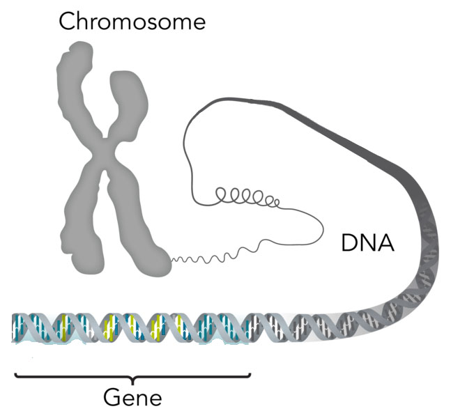
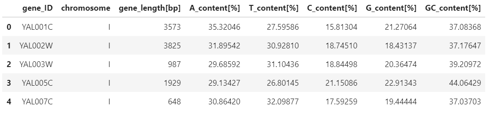
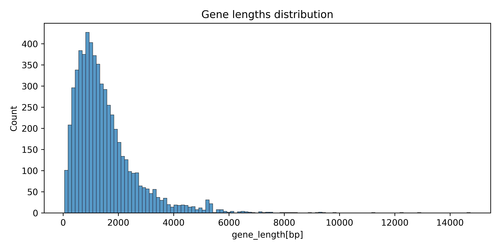
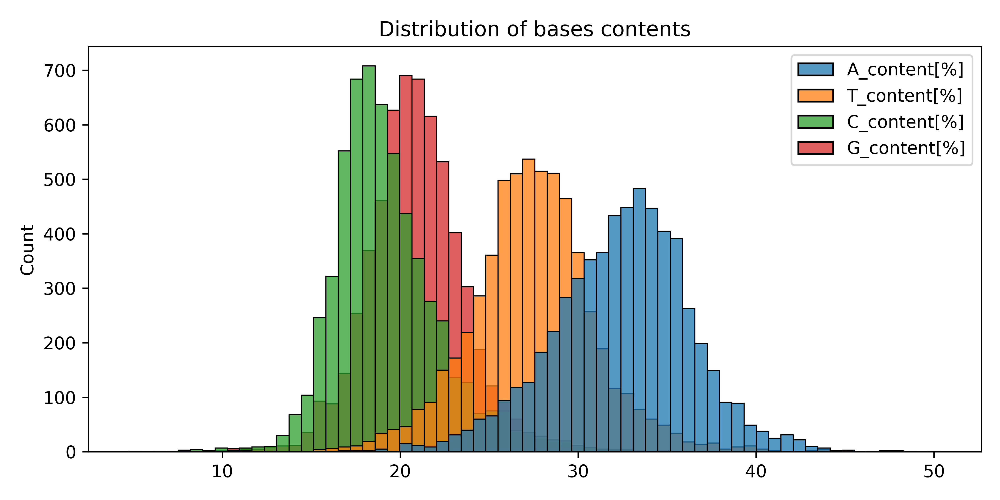
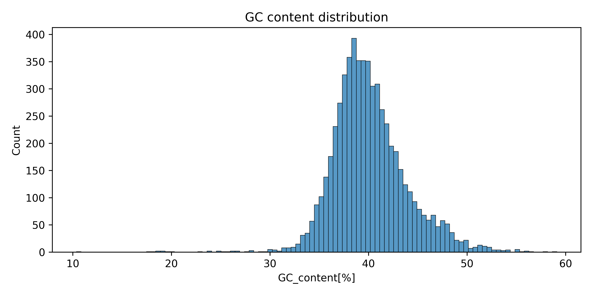
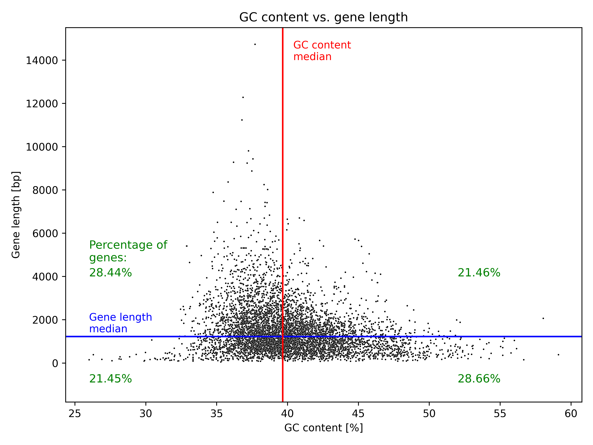
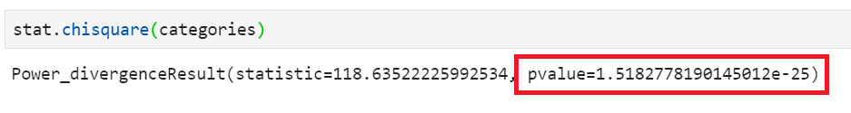
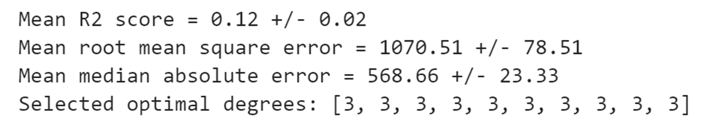
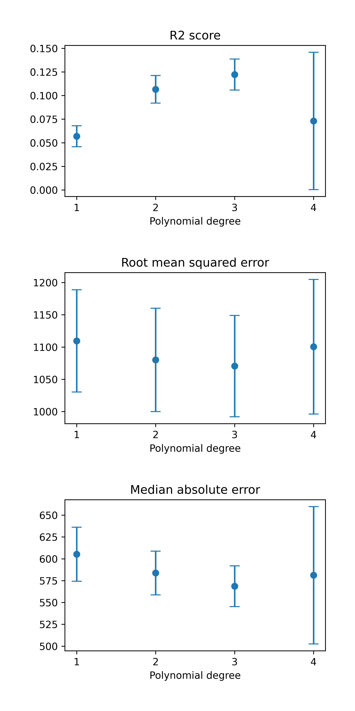
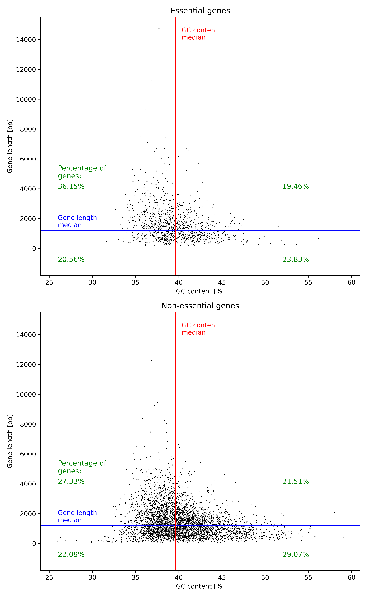

## 1) Theoretical introduction

Welcome to my project, in which I am going to analyse some yeast genomic data and try to build some machine learning models to predicts some of the genes' features. However, because it could be browsered not only by biologists, but also by people without relevant background, I provide below a short explanation of genetics fundamentals. Many simplifications have been done, yet I hope the basics of genetics relevant for this project are adequately explained. So, without further ado, let's start.

Every living organism contains instructions allowing development and functioning of an individual. These instructions are encoded in DNA - a long, chain-like molecule consisting of two strands which forms a famous double helix structure. Each strand is a string of four different elements called bases. They are adenine (A), thymine (T), cytosine (C) and guanine (G) and order of these bases determines information about a living organism. Both strands in DNA molecule are complementary - a each base from one strand interacts with a respective base from the other strand. A interacts with T, and C interacts with G, and vice versa. I think that the below image explains it enough, but to have a full picture, I wrote also the create_complementary_strand function converting a DNA strand into its complementing strand. By playing a bit with it, I think the idea behind creating complementary DNA strands should be clear.

```python
def create_complementary_strand(your_strand):
    '''Creates a complementary DNA strand to given DNA strand.'''

    # Making sure the given sequence format will be suitable for conversion.
    your_strand = your_strand.replace(' ', '').upper()

    complementation_pattern = {
        'A' : 'T',
        'T' : 'A',
        'C' : 'G',
        'G' : 'C'
    }

    complementary_strand = ''

    for base in your_strand:
        try:
            complementary_strand = (complementary_strand + complementation_pattern[base])
        except KeyError:
            print('Error - an invalid bases was in given in the original DNA strand')
            print('Can not create a complementary_strand')
            complementary_strand = False
            break

    return complementary_strand
```
   
And here a simple example to ilustrate this function:

Before we jump into data analysis and model building, a few more theoretical notes:

* while bases sequence determines a living organisms features, it also determines DNA physico-chemical properties: G and C interaction between two strands is stronger than A and T interaction. This means that the more C and G a DNA molecule have, the more energy is required for strands separation to overcome interactions between complementary bases.
    
* organisms  have several DNA molecules in each cell. For example, humans have 46 separate DNA molecules, 23 from each parent. Each of this molecule forms a chromosome - this characteristic X shape structure which is a condensed DNA form. One can also find other DNA molecules in living cells, such as mitochondrial chromosome. Yes, the powerplant of the cell has their own DNA!
    
* instructions encoded in DNA are not located on the whole DNA molecule but in fragments called genes. The analogy here could be a file saved on a hard drive - like a file takes only some of the available space on a hard drive, a gene occupies only a fragment of the whole DNA strand of a particular sequence. Like a file has its onw size, a gene has its own length. And like there could be many files on a hard drive, there could be many genes on a single DNA strand. See the picture below which may help you to visualise.




I hope that this short introduction would be helpful to understand what I present in this project.

## 2) What was done

Here, I alalyze genomic data from Saccharomyces cerevisiae yeast. This little organism is not only famous for its achievements in bread and beer making, but also in biological sciences where it serves as a model organism. It was the first eukaryotic organisms with known DNA sequence. Yeast is well characterised and much is known about its genetic. Moreover, I carried out my PhD research using yeast, therefore it was a natural choice of an organism for this project.

I analyzed several parameters of yeast genes such as relation between bases contents, gene length and if any particular cluster are formed. Finally, I built two machine learning models for predicting a gene lenght and a predicting if a gene is essential for yeast cell survival or not.


## 2) Techniques and tools used in the project

* Exploratory analysis
* Regression model
* Classification model
* Python and its libriaries: scikit-learn, biopython, pandas, numpy, matplotlib, seaborn, scipy
* Statistics: chi-squared test

## 3) Data colletion

Data origins from https://www.yeastgenome.org/. The main data file (orf_genomic.fasta) contains all yeast genes, together with their sequences and some basic information about them. Also, I used 2 other data files (essential_genes.txt, non_essential_genes.txt) that tells us which genes are essential for yeast cells survival, and which are not.

## 4) Results

Below, I present some of the results of the project. Check out jupiter notebook files for the full story.

### Exploratory analysis
Data will be imported from the orf_genomic.fasta file using SeqIO interface from Bio library. Data contains all yeast genes IDs, their sequences and at which chromosomes they are localised. I aim to create a dataframe containing: gene ID, gene length, chromosom and content of each bases. Also, I count summed contents of G and C bases - this parameter is interesting in genetics, because the higher summed GC content, the more energy is required to separate DNA strands.



The data frame looks fine. Let's do some histogram to look for distribution of some of the genes features.



Gene lengths ranges up to approx. 15000 base pairs, however only few of them are longer than 5000. Most of them have length of around 500-2000 base pairs.



The charts shows that adenine content is the highest in yeast genes (most between 25% and 40%). The lowest is guanine (most between 15%-25%).



GC content for most of the genes ranges from 30% to 50%, significantly peaking around 40%. The distribution is slightly skewed to the higher values.

Basic histograms look fine. In this section, I'd like also to take a look if there is any correlation between GC content and gene length. I create a scatter plot showing this relation. I also mark medians for both features and count what percentage of all genes is located in each quarter to see if some are overrepresented.



While there is no clear corelation between GC content and gene length and most of the genes are localized around the intersection point of both medians, an interesting phenomenon is visiible - longer genes (above 2000 bp) tend to have GC content lower than the median. There are not genes longer than 7000 bp with GC content above the median. Reverse tendency is observed for short genes - genes below gene length median tend to have higher GC content. Perhapse, it will be possible to create a ML model predicting GC content based on gene lenth (or vice versa), however the lack of obvious correlation implies that this kind of a model will rather not be very useful.

The differences in genes distribution in each quarter are rather low and differ for around 3.5 percentage points from expected 25%. However, for a dataset of this size, even such a low difference may indicate some phenomenon which is not explained by randomness. To check if observed differences could have some statistical significances, I perform a chi-squared test for one  using stats module of scipy library.



A very low p-value indicates that observed differences in contents in each quarter are statisticly significant. One can tell that that the longer a gene is, an expected GC content tend to be lower than the median, and vice versa - shorter genes tend to have higher GC content.

### Regression model

I try to build a regression model for predicting a gene length base on its bases contents and chromosom at which is localised. Here is a roadmap for building my model:

- polynomial regression model - good to check what degree of a polynomial will yield the best results, linear model may not be optimal.

- nested cross-validation as a general good practice in model building. Inner loop done by GridSearchCV() function select optimal parameter (in our case a degree of a polynomial) for the model. Outer loop done by cross_validate() function results in more accurate model evaluation - testing model on several test sets prevents us from overestimating (or underestimating) model performance. To make sure that testing sets are not participating in model training, GridSearchCV() is used as an estimaor argument in cross_validate().

- R2 score will be used in GridSearchCV() for selecting optimal degree for the model.

- I want to know what is the best degree selected by GridSearchCV() during each split done by cross_validate() to see if there is a 'universal' optimal degree for various training sets. For that, I extract the optimal degree for each split by using .best_params_. Results will be stored in best_degrees list.

- several metrics will be used: ean of R2 scores, root mean square errors and  median absolute errors and their standard deviations. This will give us more information about model performance.

Here is the code for the model building and its evaluation:

```python
# Preparing y and X datasets.
y = all_genes_df['gene_length[bp]']
X = all_genes_df.drop(['gene_length[bp]', 'gene_ID', 'category', 'GC_content[%]'], axis=1)

# Defining an estimator and list of degrees for checking.
poly = PolynomialFeatures()
lin_reg = LinearRegression()
estimator = make_pipeline(poly, lin_reg)

# Selecting parameters for model tuning.
param = {'polynomialfeatures__degree' : [1,2,3,4]}

# Creating best_degrees list for storing best degrees in each cross_validate split.
best_degrees = []

# Preparing metrics for model evaluation on test sets.
scoring = {'r2' : make_scorer(r2_score), \
           'mse' : make_scorer(mean_squared_error), \
           'mae' : make_scorer(median_absolute_error)}

# Performing nested cross-validation. R2 score for model tuning and metrics in scoring for model evaluation.
cv_inner = 10
cv_outer = 10

best_model = GridSearchCV(estimator, param, cv=cv_inner, scoring='r2')
scores = cross_validate(best_model, X, y, cv=cv_outer, scoring=scoring, return_estimator=True)

# Calculating means and standard deviations of each metric scores from splits done by cross_validate().
r2_mean = round((scores['test_r2']).mean(), 2)
r2_std = round((scores['test_r2']).std(), 2)

rmse_mean = round((scores['test_mse']**0.5).mean(), 2) # Extracting roots from mean_squared_errors.
rmse_std = round((scores['test_mse']**0.5).std(), 2)

mae_mean = round((scores['test_mae']).mean(), 2)
mae_std = round((scores['test_mae']).std(), 2)

# Extracting best_params for each cross_validate() (outer loop) split.
for i in range(cv_outer):
    best_degrees.append(scores['estimator'][i].best_params_['polynomialfeatures__degree'])


# Results of the model evaluation
print('Mean R2 score =', r2_mean, "+/-", r2_std)
print('Mean root mean square error =', rmse_mean, "+/-", rmse_std)
print('Mean median absolute error =', mae_mean, "+/-", mae_std)
print('Selected optimal degrees:', best_degrees)
```
    
Model performance was pathetic though...



As predicted in data exploration part, my regression model predicting gene length is useless. Standard deviations for each metrics are rather low, which shows that model performs comparably in various tests sets. In each split in outer loop the most optimal degree for model functioning is 3. 

The model evaluation is not encouraging, but it is still interesting that the R2 score, despite being very low, is above 0. One would expect that gene length, chromosome localization and bases contents are independent features, but here I show that there is a weak relationship between them. Another interesting finding is that median absolute error is much lover than root mean square error. This means that for some genes model performs much better, having a mistake below 568 bases for 50% of the genes, while for the whole dataset the average error is 1070 bases.

The GridSearchCV() function, in each cross_validate() split, always selected 3 as the optimal degree. I still want to see how model performs for other degrees. I create a loop in which a desired number of degrees will be tested and later metrics (R2 score, root mean square error, median absolute error)  will be shown for each degree. A single cross-validation will be performed since we want metrics for each degree. Because data sets are splited the same way during each round of cross-validation, degrees will be tested on the same datasets. Below I present results of evaluations of model with various polynomial degrees.



The chart shows that 3 indeed seems to be optimal degree - not only R2 score is the highers, the erros for other metrics are the lowest.

I played a bit with higher degrees, however above the 4th model become very unstable (huge standard deviations) and difference between 1sth and 4th degrees are not visible on the chart, so I leave charts up to the 4th degree only.

The fact that models performance changes depending on the polynomial degree means that gene lenghts predictions are not completely random, yet poor evaluation metrics indicate no practical application for this model.

### Classification model

As a class to be predicted I selected whether or not a gene is essential. A gene is essential, when yeast is not viable at all when the gene is removed. Around 20% of yeast genes are essential. I labeled genes as essential or not in our data frame using data from essential_genes.txt and non_essential_genes.txt files. Before starting building a classification model, I play a bit with data and want to see how essential genes are distributed. I adapt a previously used scatter plot to show what is GC content - gene length relation among essential and non-essential genes.



General pattern visible on the scatterplots is similar for essential and non-essential genes. However, while percentage shares of genes in each quarter for non-essential genes are comparable with values for all the genes in the previous scatterplot (differences around 1 percentage point), higher differences are observed for essential genes, especially for the quarter where genes with GC content below the median and length above the median. 36.15% of all essential genes are localised in this quarter, while for all investigated genes it was 28.44%. One should expect higher deviations in smaller datasets, but it still looks like a high enrichement. I analyse observed values with chi-squared test to see if differences in genes distributions among quarters are statistically significant.


Very lov p-value (4,4 * 10<sup>-7</sup>) indicates that differences that distributions of essential and non-essential genes among quarters are significantly different.

Ok, let's start classification. I plan to predict whether a gene is essential or not based on its length, bases content and chromosome on which is localised. Here is the roadmap for the model: 

- essential genes are not a separate cluster, therefore distinguishing them from non-essential genes by support vector machine or logistic regression seems a poor choice. However, as we see in the previos charts, there are areas in which essential genes appear more often. This gives some hopes for k-nearest neighbors algorithm, which classify records based on neighboring samples. This algorithm will be used then.

- I would like to see how model performs for various k-neighbors. For that, I create outer loop which will test every indicated k-neighbor.

- optmal distance metric (euclidean or manhattan) as well as model evaluation will be done by nested cross-validation. GridSearchCV (distance metric parameter tuning) and cross_validate (model evaluation) functions will be used for nested cross-validation. I would like also to see how many times a particurlar distance metric will be choosen during each round of GridSearch cross-validation.

- for distance metric selection, recall will be used as evaluation metric. Recall (sensitivity) tells how good is the model in detectng positive class (in our case - essential genes) in a dataset, which is crucial feature in this task - we want to detects as many essential genes as possible. Therefore, recall seems the most important evaluation metric is this aspect.

- for evaluation on the test set, I will again use recall. However, a high recall value could be caused not by model ability to recognize essential genes, but by a tendency to label as many genes as possible as essential. This will result in many false positives, because many non-essential genes will be labeles as essential. To control if model is not biased in this manner, I would like to see in model evaluation also recall of a negative class (or specificity), which will tell us how good is the model in finding negative classes.

- since there is no default metric allowing us to see  recall of a negative class, I create the recall_neg_class function which will extract required data for calculating recall of a negative class from confusion matrix.

And here is the code:

```python
# Preparing y and X datasets.
mapper = {'yes' : True, 'no' : False} # preparing mapper for assigning boolean data type instead of yes/no in 'is_essental' column
y = all_genes_df['is_essential'].map(mapper)
X = all_genes_df.drop(['is_essential', 'gene_ID', 'category', 'GC_content[%]'], axis=1)

# Defining recall_neg_class function.
# Function is based on a solution proposed by sedeh (https://stackoverflow.com/questions/33275461/specificity-in-scikit-learn).
def recall_neg_class(y_true, y_pred):
    tn, fp, fn, tp = confusion_matrix(y_true, y_pred).ravel()
    value = tn / (tn + fp)
    return value

# Defining k-neighbors for model tuning.
neighbors = list(range(1,10,2))

# Creating lists storing metrics scores and selected distance metric during each GridSearchCV round.
recall_mean_list = []
recall_std_list = []

recall_neg_means_list = []
recall_neg_std_list = []

euclidean_distance = []
manhattan_distance = []


# Outer loop iterating over choosen k-neighbors.
for k in neighbors:

    clf = KNeighborsClassifier(n_neighbors = k)

    # Selecting parameters for model tuning.
    param = {'metric' : ['euclidean', 'manhattan']}
    best_param = []

    # Preparing scoring metrics for model evaluation.
    scoring = {'recall' : make_scorer(recall_score), \
               'recall_neg': make_scorer(recall_neg_class)}

    # Performing nested cross-validation, recall score for model tuning, recall and recall_neg for (scroring dictionary) for model evaluation.
    cv_inner = 10
    cv_outer = 10

    best_model = GridSearchCV(clf, param, cv=cv_inner, scoring='recall')
    scores = cross_validate(best_model, X, y, cv=cv_outer, scoring=scoring, return_estimator=True)

    # Calculating means and standard deviations of each metric scores from splits done by cross_validate().
    recall_mean = round((scores['test_recall']).mean(), 3)
    recall_mean_list.append(recall_mean)

    recall_std = round((scores['test_recall']).std(), 3)
    recall_std_list.append(recall_std)

    recall_neg_mean = round((scores['test_recall_neg']).mean(), 3)
    recall_neg_means_list.append(recall_neg_mean)

    recall_neg_std = round((scores['test_recall_neg']).std(), 3)
    recall_neg_std_list.append(recall_neg_std)

    # Extracting information how many times each metric was used during each GridSearchCV round.
    for i in range(cv_outer):
        best_param.append(scores['estimator'][i].best_params_['metric'])

    euclidean_distance.append(best_param.count('euclidean'))
    manhattan_distance.append(best_param.count('manhattan'))
```
